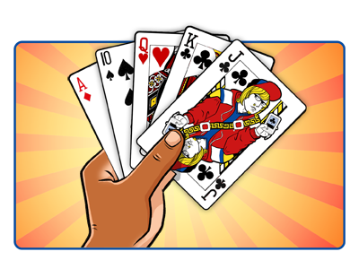

```{r setup, include=FALSE}
knitr::opts_chunk$set(echo = TRUE)
```

<div style="min-width:100px;width:90%;max-width:696px;">

<center></center>


# Introduction

We begin with a deck of playing cards. A standard deck consists of fifty-two
cards in each of the four suits of Spades, Hearts, Diamonds and Clubs. A suit
in turn consists of thirteen cards: Ace, 2, 3, 4, 5, 6, 7, 8, 9, 10, Jack,
Queen, and King. 

We then assign a value to each of the fifty-two cards.
An Ace is assigned a value of 1. Numbered cards are each assigned a value
equivalent to the number printed on it (e.g. a two spades is assigned
a value of 2). Face cards (Jack, Queen and King) are assigned a value of 10.

```{r echo=FALSE, message=FALSE, warning=FALSE}
library(prob)
library(ggplot2)
library(ggthemes)
library(scales)
library(RColorBrewer)
library(grid)

cards.df <- cards()
```


Table 1. Schedule of card rank and assigned values

| Card Rank         	| Value     	|
|-------------------	|-----------	|
| Ace               	| 1         	|
| 2 thru 10         	| 2 thru 10 	|
| Jack, Queen, King 	| 10        	|


<br/>

## Simulating A Single Card Draw


For the purposes of this study, I constructed a data frame object and
initialized it with data to mimic a typical deck of fifty-two playing cards.
Each row represents a playing card and consists of two variables:
`rank` and `suit`.  

Let's look at the structure of the data frame that we have created:

```{r warning=FALSE }
# Display the internal structure of the cards.df data frame
str(cards.df)

```

For a peek at the first few items in our data frame, we use the `head` command:

```{r warning=FALSE}
# Show the top parts of the cards.df data frame
head(cards.df)
```


<br/>    
    
#### Data Wrangling: Assign Weights By Card Rank

I defined a custom function called `AssignRank` and applied it to each of the
`cards.df` data frame's `rank` values using the `sapply` function  
to generate a numeric vector of values based on the requirements we have
described above.  These collection of values are then added as a new variable
(`value`) to the `cards.df` data frame.


```{r warning=FALSE}
AssignRank <- function(rank) {
  # Returns a value given a card's rank
  # Args:
  #   x: A card's rank (ex. "Qd" for Queen of diamonds)
  #
  # Returns:
  #   An assigned value
  vrank <- as.vector(rank)
  if (vrank == c("A")) {
      return(c(1))
  } else if (vrank %in% c("J","Q","K")) {
      return(c(10))
  } else {
      return(as.numeric(vrank))
  }
}
```

```{r echo=FALSE, warning=FALSE}

# Create a numeric vector of values
values <- sapply(cards.df$rank, AssignRank)

# Add a numeric variable to the dataframe
cards.df$value <- values

# Add a factored variable to the dataframe representing the values
cards.df$value.level <- factor(values)
rm(values)

```

Below is a glimpse of the first few rows of the newly updated `cards.df` 
data frame after adding the `values` variable.

```{r, warning=FALSE}
head(cards.df)
```


| No 	| Rank 	| Suit 	| Value 	|
|----	|------	|------	|-------	|
| 1  	| 2    	| Club 	| 2     	|
| 2  	| 3    	| Club 	| 3     	|
| 3  	| 4    	| Club 	| 4     	|
| 4  	| 5    	| Club 	| 5     	|
| 5  	| 6    	| Club 	| 6     	|
| 6  	| 7    	| Club 	| 7     	|


<br/>

## Distribution of Playing Card Values

The distribution of each card value and the number of cards in the deck
that hold such value is given in the relative frequency plot below.


<!------------
```{r, eval=FALSE, echo=FALSE, warning=FALSE}
g <- ggplot(cards.df, aes(value.level))
g +  geom_bar(width = 1, fill = "#26c6da", alpha = 0.6) +
     scale_y_continuous(breaks = seq(0, 16, by = 4)) +
     theme_fivethirtyeight()+
     labs(title = "Relative Frequency of Card Values",
          subtitle = "Weights assigned for each card rank",
          caption = "Figure 1") +
      theme(axis.title = element_text()) + 
      ylab('Frequency') +
      xlab('Card Value')
```
------------->


```{r echo=FALSE, warning=FALSE}
ggplot(cards.df, aes(x = value)) +  
   geom_histogram(binwidth = 1, fill="#26c6da", alpha = 0.6, boundary = 0.5) + 
   scale_x_continuous(breaks = seq(0, 10)) + 
   scale_y_continuous(breaks = seq(0, 16, by = 4)) + 
   theme_fivethirtyeight() + 
   labs(title = "Relative Frequency of Card Values",
          subtitle = "Weights assigned for each card rank",
          caption = "Figure 1") +
      theme(axis.title = element_text()) + 
      ylab('Frequency') +
      xlab('Card Value')

```


```{r eval=FALSE, warning=FALSE}
ggplot(cards.df, aes(x = value)) +  
   geom_histogram(binwidth = 1, fill="#26c6da", alpha = 0.6, boundary = 0.5) + 
   scale_x_continuous(breaks = seq(0, 10)) + 
   scale_y_continuous(breaks = seq(0, 16, by = 4)) 
```

The population distribution of the card values is unimodal, asymmetric and negatively
skewed.

From the above visualization we can see that there are four cards
with a value of `1` (Ace of Clubs, Ace of Hearts, Ace of Diamonds, Ace of 
Spades), four cards with a value of `2` (Two of Clubs, Two of Hearts, Two of 
Diamonds, Two of Spades), and so on and so forth.

Also shown is the fact that there are sixteen cards with a value of 
10 -- four number ten cards from every suit and four Jacks, four Queens and 
four Kings for each of the suits.

We can alse see from the distribution of the relative frequency of the values 
of the playing cards that there is a uniform chance of picking any of 
of the numbered cards (Ace through 9) and that there is a more favorable
chance of picking a 10-value card because there are more of them (16 to be
exact).  

<br />

### Distribution From A Single Draw

Let's examine the characteristics of our newly-created playing
card distribution. We can start with the preliminaries: the minimum 
and maximum values as well as some measures of central tendency.


```{r warning=FALSE}
summary(cards.df$value)
```

The average value of the single-draw dataset is 6.538 and the median is 7.000.
The distribution of the cards has a negtive skew owing to the manner in which
center of the distribution (mean = 6.538) is lower than the median (7.000). 

This confirms what we already know: there is a considerable number of cards 
that have high values than the rest. In fact, sixteen cards (all face cards and four
numbered cards) possessed a value of 10 while the rest of the cards
(Ace through 9) only had a count of four.

The boxplot below provides a standardized way of displaying the 
distribution of the card values based on the five-number summary we
have just shown.


```{r, echo=FALSE, message=FALSE, warning=FALSE}

ggplot(data = cards.df, aes(x="", y = value)) +
  geom_boxplot(varwidth = TRUE, 
               lwd = 1,
               fatten = 1,
               fill="#26c6da", 
               alpha = 0.6) +
  coord_cartesian(ylim = c(1, 10)) +
  scale_y_continuous(breaks = seq(0, 10, by = 1)) +
  theme_fivethirtyeight() +
  labs(title = "Distribution of Card Values",
       subtitle = "Single Draw",
       caption = "Figure 2") +
  theme(axis.title = element_text()) + 
  ylab('Card Value') +
  xlab('')

```
```{r, eval=FALSE, message=FALSE, warning=FALSE}

ggplot(data = cards.df, aes(x="", y = value)) +
  geom_boxplot(varwidth = TRUE, fill="#26c6da", alpha = 0.6) +
  coord_cartesian(ylim = c(1, 10)) +
  scale_y_continuous(breaks = seq(0, 10, by = 1)) 

```

Most of the cards cluster around the higher values (7, 8, 9, 10). Half of the cards have 
values more than 7 and the card values are more dispersed around the first
and second quartile (from 1 through 6). 

The boxplot confirms that the shape of the distribution 
is unimodal with a negative skew, centered around the median value of 7, and 
has a considerable amount of spread with most of the cards clustered over values higher than the second quartile ($\chi_i > 7$). The absence
of the top whisker and a short bottom whisker tells us that most of 
the cards have high scores.


> The second quartile (symbol Q<sub>2</sub>) is the number that
> cuts a set of numerically ordered data into a lower and upper half. It's 
> more popularly called the median.

<br/>

#### Cards - The Population Standard Deviation

The population size of this experiment is small (`n = 52`),
so it is possible to obtain a population parameter that we need. 
The standard deviation can be determined using the following formula:

<!-- <div style="font-size:20px; text-align:center"> -->
<!-- $\sigma^2 = \frac{s^2 (n-1)}{n}$ -->
<!-- # var(x) * (length(x) - 0) / length(x) -->
<!-- </div> -->

<div style="font-size:20px; text-align:center">
$\sigma = \sqrt\frac{\sum(X_i-\mu)^2}{n}$
</div>

Let's declare a few functions to express the standard deviation
formula below:

```{r warning=FALSE}
# Population variance
pop.var <- function(x) {
  (sum((cards.df$value - mean(cards.df$value))^2)/length(cards.df$value))
}

# Popluation standard deviation
pop.sd <- function(x) sqrt(pop.var(x))
```

Once the functions are in place, we pass on our card values to `pop.sd()` to retrieve the
standard deviation for our card values.

```{r echo=FALSE, warning=FALSE}
SD.pop_cards <- pop.sd(cards.df$value)
sprintf("Standard deviation: %s", round(SD.pop_cards, 4))
```

#### Interquartile Range (IQR) of the Population

Another measure of dispersion is the interquartile range (IQR). 

```{r eval=FALSE, warning=FALSE}
IQR(cards.df$value)
```

```{r, echo=FALSE, message=FALSE, warning=FALSE}
sprintf("Population IQR: %s", IQR(cards.df$value))
```


For the population of card values, its IQR parameter of 6 tells us
that the values of the cards are quite variable. It also tells us that 
half of the card scores are between 4 and 10. 

A summary of the descriptive statistics of the scores based on a single card draw is given below.

<div style="font-family: Consolas">

|                    |       |
|--------------------|------:|
| Min                | 1.00  |
| 1Q                 | 4.00  |
| Median             | 7.00  |
| Mean               | 6.54  |
| 3Q                 | 10.00 |
| Max                | 10.00 |
| Standard Deviation | 3.15  |
| IQR                | 6.00  |
</div>


<br/>

## Simulating Three Card Draws

In the previous activity, we explored various ways of describing the distribution of 
playing card scores when all the items that make up the population is available.

But it is usually not quite convenient to glean the characteristics of a population 
since most often than not, all the data for our subject of interest is not always available.

There is a way to systematically gather these characteristics by using a subset of the
population in a method called [sampling](https://en.wikipedia.org/wiki/Sampling_(statistics)). As long as each item has an equal chance of being selected in a sample, we can use some tools along with point estimates to make informed inferences about the larger population.

In this section, we are going to examine and describe the 
distribution of playing card scores when drawing three cards. 
Each trial or sample consists of drawing three cards and generating
statistics on the outcome of each trial based on the scores of the 
cards drawn. As how it was in single card scenario, each card is assigned
a value depending on its suit and rank. After each sample, the cards that 
were drawn are placed back into the deck to prepare the deck for the next trial. 

The terms _trial_ and _sample_ will be used synonymously going forward. Each 
trial or sample consists of the evaluated scores from three card draws with each
draw representing a sampling unit. Thus, each sample would have a sample size of
3.

I implemented these requirements by constructing a dataframe called `trials.df` consisting of 
rows that represent a sample. Each observation in the dataframe simulates three 
random draws from a deck of playing cards. 


```{r echo=FALSE, message=FALSE, warning=FALSE}
# my_seed  = 1234


trial <- sprintf("%s",seq(1:30))
draw.first <- c('Qd' ,'9d' ,'9h' ,'Kc' ,'5s' ,'10c',
            'Ks' ,'3h' ,'5c' ,'3h' ,'6s' ,'Js',
            'Ah' ,'Qs' ,'5h' ,'8c' ,'Jd' ,'3c',
            '10c','9c' ,'8s' ,'4d' ,'Qs' ,'10s',
            '3s' ,'10s','5d' ,'9h' ,'Jh' ,'9d')

draw.second <- c('10s','10d','5c' ,'2c' ,'7h' ,'6c',
            'Qd' ,'Qs' ,'5h' ,'8h' ,'Kc' ,'2h',
            'Ac' ,'7s' ,'9c' ,'10d','8c' ,'2s',
            '9c' ,'5d' ,'6s' ,'Qs' ,'4d' ,'2d',
            '7c' ,'7c' ,'Ks' ,'8h' ,'4d' ,'2s')

draw.third <- c('Ac','5h','Ad','3d','8c','Ac',
            '4c','6h','2s','Ks','10d','2c',
            '8c','3c','3h','2d','3s','3d',
            'Jd','3c','5s','2d','7d','4d',
            '10c','2h','4d','5s','9c','9c')


trials.df <- data.frame(trial)
trials.df$dr1 <- draw.first
trials.df$dr2 <- draw.second
trials.df$dr3 <- draw.third


```

The first few rows of the newly created `trials.df` dataframe is shown below. 

```{r warning=FALSE}
head(trials.df)
```

The columns `dr1`, `dr2` and `dr3` contain the outcomes of the 
randomly generated card draws (three for each sample). Each value is encoded as 
a pair of characters consisting of the rank (A, 2-10, J, Q, K) 
followed by the suit (c, d, h, s). 

```{r warning=FALSE, echo=FALSE, message=FALSE}

GetRankValue <- function(rank) {
  #
  # Assign a card value given a card's rank
  #
  result <- switch(substr(rank, start = 1, stop = 1),
                   "A" = c(1),
                   "2" = c(2),
                   "3" = c(3),
                   "4" = c(4),
                   "5" = c(5),
                   "6" = c(6),
                   "7" = c(7),
                   "8" = c(8),
                   "9" = c(9),
                   "J" = c(10),
                   "Q" = c(10),
                   "K" = c(10))
  
  test2 <- substr(rank, start = 1, stop = 2)
  if(test2 == "10"){
    result = c(10)
  }

  return(result)
}


# Build a vector of numeric card values for each draw

values1 <- as.vector(sapply(trials.df$dr1, GetRankValue))
values2 <- as.vector(sapply(trials.df$dr2, GetRankValue))
values3 <- as.vector(sapply(trials.df$dr3, GetRankValue))

# 

trials.df$dr1.value <- values1
trials.df$dr2.value <- values2
trials.df$dr3.value <- values3


```

```{r, echo=FALSE, message=FALSE, warning=FALSE}

GetAverages <- function(df) {
  size <- nrow(df)
  means <- numeric()
  for (i in 1:size) {
    values <- c(df[i, ]$dr1.value, 
                df[i, ]$dr2.value,
                df[i, ]$dr3.value)
    lmean <- round(mean(values), 2)
    means <- c(means, lmean)
  }
  
  return(means)
}

```

### Distribution of Three-Card Sums

The `trials.df` dataframe consists of thirty trials or samples. Three random
card draws make up each sample and each draw is assigned a score as what 
was done previously in the single card draw activity. Each sample then
would have a sample size of 3.

We are currently interested in the sum of the scores for each sample. 
I have constructed a function called `GetSumOfScores()` that will return a numeric vector of 
all the row-wise sums of scores from a dataframe argument.


```{r, message=FALSE, warning=FALSE}

GetSumOfScores <- function(df) {
  # Returns a vector of the sum of scores obtained from three scores per sample.
  # Args:
  #   df: a dataframe containing three numeric variables
  #       located in the 5th to the 7th columns
  #
  # Returns:
  #   A numeric vector of the sum of scores of each observation.#
  total <- rowSums(df[, c(5,6,7)])
  return(total)
}
```

Then, we append the numeric vector of the sum of scores that is returned by the function
to the same dataframe as its own separate column named `sum_scores`.

```{r}
trials.df$sum_scores <- GetSumOfScores(trials.df)
```

Let's take a glimpse of the first few rows of our `trials.df` dataframe
and the new sum of scores that we have generated for each sample.

```{r}
head(trials.df, 10)
```

A summary of the descriptive statistics on the sum of scores for all thirty samples is shown below.

```{r}
summary(trials.df$sum_scores)
```

The descriptive statistics tells us that a majority or half of the sum of scores
are not that far away from the mean. The first quartile (16.25) is just about 2.58 points
from the mean while the 3rd quartile (21.00) is 2.17 points from the mean.

The interquartile range (IQR) of around 5 is quite small relative to the minimum
and maximum possible values attainable by the sum of scores. A low standard deviation
of 4.48 for the sample along with the IQR shows the narrow spread of the data
and that a quite a majority of the sum of scores are clustered around the mean.

The mean having a value (18.83) slightly lower than the median (19.50) suggests
that we can expect a slight negative skew in our distribution of the sum of scores.

A frequency distribution of the sum of scores from our dataset is displayed below.


```{r , echo=FALSE, message=FALSE, warning=FALSE}
ggplot(trials.df, aes(x = trials.df$sum_scores)) +
  geom_histogram(binwidth = 2, 
                 fill="#8bc34a", 
                 alpha = 1, 
                 boundary = 0.5,
                 aes(y=..count..)) +
  scale_x_continuous(breaks = seq(0, 30, by=3)) +
  theme_fivethirtyeight() +
  labs(title = "Frequency Distribution of Sum of Scores",
       subtitle = "Distribution of sum of scores for thirty trials (n = 3)",
       caption = "") +
  theme(axis.title = element_text()) +
        xlab("Total Score") +
        ylab("Frequency")
```

Notice how our descriptive statistics finds support from the visualization. The distribution
of the sum of scores is unimodal, somewhat left skewed, and with a peak at about 19.
Much of the scores have  values falling between 15 and 24. 

The distribution of the three-card draw sum of scores is somewhat clustered around the mean
as compared to the strong, negatively skewed distribution of the single card draw.
The reason for this is because we usually would not expect to obtain a sum of scores for 
three-card draws that amount to as low as 3 or as high as 30 whereas the likelihood
of getting a sum of scores similar to 19 (the median) is greater. For example, there is 
only one combination of playing card sums that will give us a total of 3: successively
drawing three aces. Contrast this to the number of combinations of playing card sums that 
will return a total of 19: there are around 14 such combinations (examples are
10, 8, 1 or 10, 7, 2 or 10, 6, 3, etc.)

###### Comparison of Single Card Draw and Sum of Scores

| Descriptive Statistics | Single Draw | Sum of Scores |
|------------------------|:-----------:|--------------:|
| Sample Size            |      1      |        30     |
| Mean                   |     6.540   |        18.83  |
| Median                 | 7.000       |        19.5   |
| Standard Deviation     | 3.150       |         4.48  |
| Minimum                | 1.000       |         8.00  |
| 1st Quartile           | 4.000       |        16.25  |
| 3rd Quartile           | 10.000      |        21.00  |
| Maximum                | 10.000      |        29.00  |


The single card draw distribution exhibits a very strong negative skew
because and the entire third quartile of the scores has a value of 10
which is also the maximum possible score for the dataset.

The three-card sum of scores distribution has its first and 
third quartile relatively close to its median, while the median itself
is very near the mean. Along with the shape of the histogram, we 
can say that the distribution of the three-card sum of scores 
is approximately normal.

###### Estimates on Future Three-Card Sum of Scores Draws

We can make some educated estimates regarding the possible outcomes of 
future draws because of the approximately normal distribution of our
three-card draw sum of scores data.  We can take advantage of some
inferences that is allowed by a theoretical normal standard distribution model.

Within what range can we expect approximately 90% of the thee-card draw sum of scores data to fall?

The total area underneath the graph of a probability density function is equal to 1.00
(a total probability of 100%). 
90% of the area would lie in the middle of the distribution centered on the mean. This leaves
an area of 0.05 to the left and 0.05 to the right of the area occupied by the 0.90 region.

The z-score that will give us a probability (area) of 0.05 on the left side of the mean is -1.6448. 
Since we know the mean (18.83) and the standard deviation (4.48) of the sum of scores,
we can use the following formula to determine the sum of scores below which 5% of the 
other some of scores lie:

<div style="font-size:20px; text-align:center">
$z = \frac{X-\bar{x}}{s}$
</div>

Solving for X, we arrive at the following calculation:

<div style="font-family:Consolas; padding-left: 20px;">
18.83 + (-1.6448)(4.48) = 11.4613
</div>

Since the shape of a standard normal distribution is symmetrical on the both
sides of the mean, we can use a z-score of postive 1.6448 to represent the region
of the curve that contains the upper 5% of the sum of scores distribution.

<div style="font-family:Consolas; padding-left: 20px;">
18.83 + (1.6448)(4.48) = 26.1987
</div>

Therefore, we can expect approximately 90% of the three-card draw sum of scores to fall within
11 and 26.

Let us try another estimate. What is the approximate probability that we will get
a draw value of at least 20?

In this problem, we are looking for the area of the region greater than 20. However,
since 20 came from a discrete set of numbers (as all possible sum of scores are) and
since the normal distribution is made up of continuous values, we have to work
with an approximation for our discrete values. We can do so by adjusting 
our threshold value from 20 to 19.5. 

In order to determine the region above 19.5, we need to look for the z-score
matching the value of 19.5. We already have the mean (18.83) and the 
standard deviation (4.48) and we can use them to determine the z-score:

<div style="font-family:Consolas; padding-left: 20px;">
z = (19.5 - 18.83) / 4.48
<br>
z = 0.1495
</div>

A z-score of 0.1495 equates to a proportion of 0.5594 in the z-table. 55.94% of the
distribution falls less than 0.1495 points from the mean in a standard normal
distribution (mean - 0, standard deviation = 1).

Using this information, we can obtain the area above 0.1495 since we know
that the area under the probability density curve is 1.00. 

<div style="font-family:Consolas; padding-left: 20px;">
P(X > 0.1495) = 1 - 0.5594 <br>
P(X > 0.1495)  = 0.4406
</div>

Thus, we can expect to get a three-card draw sum of scores of at least 20 
from a distribution with a mean sum of scores of 18.83 and a standard
deviation of 4.48 approximately 44.06% of the time.

<br>

### Distribution of Sample Means


We will use the same `trials.df` dataframe to generate a distribution
of sample means. A sample mean is calculated for each trial based on the sum of the
scores of cards drawn. Since there are thirty trials, we are looking
at a collection of thirty sample means. The distribution of the sample means
for every sample is what is called a **sampling distribution**.

Let us now prepare some descriptive statistics on the sampling distribution
of sample means.

To obtain the sample means for each trial, I developed a custom function,
`GetAverages`, that returns a vector of sample means using the playing card 
trials dataframe as an argument.


```{r, eval=FALSE, message=FALSE, warning=FALSE}

GetAverages <- function(df) {
  # Returns a vector of means obtained from three scores per sample.
  # Args:
  #   df: a dataframe containing three numeric variables
  #
  # Returns:
  #   A numeric vector of the means of each observation.#
  size <- nrow(df)
  means <- numeric()
  for (i in 1:size) {
    values <- c(df[i, ]$dr1.value, 
                df[i, ]$dr2.value,
                df[i, ]$dr3.value)
    lmean <- round(mean(values), 2)
    means <- c(means, lmean)
  }
  
  return(means)
}
```


The vector of sample means, which I called `draw.mean`, is then added as an additional column to 
our `trials.df` dataframe.  The code below shows how this is done using the 
custom function that we have defined.


```{r, message=FALSE, warning=FALSE}
# Create a collection of means for each trial's values (draw 1, draw 2, draw 3)
means <-GetAverages(trials.df)


# Append a new column to contain the means for each trial
trials.df$draw.mean <- means

```

The first few rows of the dataframe is shown below. The `draw.mean` variable
lists the averages of the scores in each trial that consists of randomly drawing
three playing cards.

```{r, warning=FALSE}
head(trials.df)
```

Some descriptive statistics for the sample means are shown below.

```{r, echo=FALSE, message=FALSE, warning=FALSE}
mean.trials <- round(mean(trials.df$draw.mean), 3)
#  sprintf("Mean of sample means: %s", mean.trials)
sd.trials <- round(sd(trials.df$draw.mean), 3)
#  standard error of the mean of sample means 
#  sample size (n = 3)
SE.trials <- round((SD.pop_cards/sqrt(3)), 4)

```

```{r echo=FALSE, warning=FALSE, message=FALSE}
summary(trials.df$draw.mean)
```

We notice from the descriptive summary that the mean (6.278) is quite close to the median (6.500) 
which indicates a symmetric distribution of sample mean observations. 

The first quartile score (5.415) and the median (6.500) has a small gap (1.085). 
The third quartile (7.000) and the median (6.500) has a small gap as well (0.5). 
What this tells us is that distribution of sample means seems to be gathered 
closely around the median as well as the mean in this case.

We can confirm this observation by referring to the sampling distribution's standard
deviation of sample means, otherwise known as the ***standard error***.

We will use the following formula to determine the standard error

<div style="font-size:20px; text-align:center">
$SE = \frac{\sigma}{\sqrt n}$
</div>

$\sigma$ would be our population standard deviation which we obtained earlier
using the single-card draw dataset: 3.1529. 

`n` represents the sample size
which is the three card draws we made for each trial (`n = 3`).

```{r, echo=FALSE, message=FALSE, warning=FALSE}
sprintf("Standard error of the sample means: %s", SE.trials)
```

A standard error of 1.82 for the mean of sample means is quite low indicating the narrow
spread of the data. The distribution's interquartile range or IQR somehow corroborates this (`IQR(trials.df$draw.mean)` returns an IQR of 1.585) as it tells us that the 
middle values which make up 50% of the individual sample mean observations 
do not vary much as they cluster around the midpoint value for all observations.

It is worth reminding that each row or observation in our `trials.df` dataframe
is not a unit from the population (deck of cards) but a sample in itself.
The sample's `draw.mean` variable refers to the mean of the 
the scores assigned to the three randomly-drawn playing cards for each sample or trial.
Therefore, each sample's `draw.mean` data is not a an individual card score
but a **sample statistic** (mean of scores).


#### The population and sampling distribution standard deviations

How does the sampling distribution standard error which is taken 
from the mean of sample means compare with the population standard deviation? 


|                                          	|       	|
|------------------------------------------	|:-----:	|
| Population standard deviation            	| 3.150 	|
| Sampling distribution standard error    	| 1.820 	|


The table above shows that the standard error of the mean of sample means
(1.8203) is remarkably lower than the population's standard deviation (3.150).

We would not expect the population standard deviation to be low since the
scores in the population are very variable. It's possible to draw a card
with an equivalent score that is as low as 1 or as high as 10.

On the other hand, the standard error of the sample means is expected
to be much lower than the population standard deviation since
we would expect the mean of each trial to be pretty near to one another.
For example we would not expect to find a sample where the average
score of three cards drawn is as low as 1 or as high as 10.

The boxplot of the sampling distribution of the sample means below shows
indeed that the means are clustered close together around the median
indicating that there is not much variability among them. Short
whiskers on both ends tell of a short-tailed distribution. The boxplot also 
allows us to infer that the distribution does not exhibit strong skews in either direction. In fact, it somehow takes on a symmetric
shape with some outliers outside the upper and lower boundaries of the
range of the distribution.


```{r, echo=FALSE, message=FALSE, warning=FALSE}
ggplot(data = trials.df, aes(x="", y = draw.mean)) +
  geom_boxplot(varwidth = TRUE,  
               lwd = 1,
               fatten = 1,
               fill="#26c6da", 
               alpha = 0.6) +
  coord_cartesian(ylim = c(1, 10)) +
  
  scale_y_continuous(breaks = seq(0, 10, by = 1)) +
  theme_fivethirtyeight() +
  labs(title = "Sampling Distribution of Card Value Means",
       subtitle = "Thirty trials. Three draws for each trial (n = 3)",
       caption = "Figure 3") +
  theme(axis.title = element_text()) + 
        ylab('Card Value Mean') +
        xlab('')
```


A summary of the descriptive statistics of the sample means from the sampling distribution with a sample size `n = 3` is given below.


<div style="font-family: Consolas">
|                    |       |
|--------------------|------:|
| Min                | 2.67  |
| 1Q                 | 5.41  |
| Median             | 6.50  |
| Mean               | 6.28  |
| 3Q                 | 7.00  |
| Max                | 9.67  |
| Standard Error     | 1.82  |
| IQR                | 1.59  |
</div>


We should take note of the mean (6.28) of the sampling distribution of the mean as well as the standard deviation (1.82) of the same sampling distribution. The standard deviation of the sampling distribution of sample means is also known as the ***standard error***. We will be referring to these values later in our discussion.

A histogram of the sampling distribution of card value means would
give us more information about the frequencies of the sample means for 
all the trials. 

```{r , echo=FALSE, message=FALSE, warning=FALSE}
ggplot(trials.df, aes(x = draw.mean)) +
  geom_histogram(binwidth = 1, 
                 fill="#8bc34a", 
                 alpha = 1, 
                 boundary = 0.5,
                 aes(y=..density..)) +
  scale_x_continuous(breaks = seq(0, 10)) +
  stat_function(fun=dnorm, 
                color="#1976d2", 
                lwd=2,
                alpha = 0.2,
                args=list(mean=mean.trials, 
                          sd = sd.trials)) +
  theme_fivethirtyeight() +
  labs(title = "Sampling Distribution of Card Value Means",
       subtitle = "Distribution of means of thirty trials (n = 30)",
       caption = "Figure 4") +
  theme(axis.title = element_text()) +
        xlab("Sample means") +
        ylab("Relative Frequency")
```


In the above histogram of the sampling distribution of sample means, 
the peak of the data occurs between 6.5 and 7.0. The data spread
is from about a little less than 3.0 to about 10.0 with much of the
means clustering around the range of from about 5.0 to 7.0.

The histogram is unimodal and somewhat symmetrical. We added 
a fitted distribution line to the visualization to assess
whether our data follow a theoretical distribution using 
a mean of 6.278 and a standard error of 1.82. The sampling
distribution appears to follow an approximate normal distribution,
but given the small sample size (n = 30), the frequency bars
are not smooth.


### Comparing the Single and Three Card Draw Distributions

The distributions of two datasets are now available to us: (1) the 
distribution of card scores based on a single draw with a sample size of 1;
and (2) the distribution of card scores based on drawing three cards with
a sample size of 3.

The descriptive statistics of these two datasets are given below to aid
us in our comparison:


| Descriptive Statistics | Single Draw | Three Card Draw |
|------------------------|:-----------:|-----------------|
| Sample Size            |      1      | 3               |
| Mean                   |     6.54    | 6.28            |
| Median                 | 7.00        | 6.50            |
| Standard Deviation     | 3.15        | 1.82            |


The mean of the two distributions are almost the same (only a 0.26 difference). The median of the distribution with 3 samples is closer to its own mean (0.22 diifference) than the median of the distribution
with only 1 sample (0.46 difference). 

The single draw distribution's mean is considerably less than the median, and this suggests a 
negatively skewed distribution. Contrast this to the three card draw's distribution's mean which 
is almost the same as its median suggesting an nearly normal distribution.

The side-by-side boxplots of the two distributions help illustrate
our descriptions. 

<!-- ```{r echo=FALSE, warning=FALSE} -->
<!-- g <- ggplot(trials.df, aes(draw.mean)) -->
<!-- g +  geom_bar(width = 1, fill = "#8bc34a", alpha = 1, boundary = 0.5) + -->
<!--      scale_y_continuous(breaks = seq(0, 10, by = 1)) + -->
<!--      theme_economist() + -->
<!--      labs(title = "Sampling Distribution of Sample Means", -->
<!--               x = "Card values", -->
<!--               y = "Frequency") -->
<!-- ``` -->

```{r multiplot_population_sampling, message=FALSE, warning=FALSE, echo=FALSE}
# Multiple plot function
#
# ggplot objects can be passed in ..., or to plotlist (as a list of ggplot objects)
# - cols:   Number of columns in layout
# - layout: A matrix specifying the layout. If present, 'cols' is ignored.
#
# If the layout is something like matrix(c(1,2,3,3), nrow=2, byrow=TRUE),
# then plot 1 will go in the upper left, 2 will go in the upper right, and
# 3 will go all the way across the bottom.
#
multiplot <- function(..., plotlist=NULL, file, cols=1, layout=NULL) {
  library(grid)

  # Make a list from the ... arguments and plotlist
  plots <- c(list(...), plotlist)

  numPlots = length(plots)

  # If layout is NULL, then use 'cols' to determine layout
  if (is.null(layout)) {
    # Make the panel
    # ncol: Number of columns of plots
    # nrow: Number of rows needed, calculated from # of cols
    layout <- matrix(seq(1, cols * ceiling(numPlots/cols)),
                    ncol = cols, nrow = ceiling(numPlots/cols))
  }

 if (numPlots==1) {
    print(plots[[1]])

  } else {
    # Set up the page
    grid.newpage()
    pushViewport(viewport(layout = grid.layout(nrow(layout), ncol(layout))))

    # Make each plot, in the correct location
    for (i in 1:numPlots) {
      # Get the i,j matrix positions of the regions that contain this subplot
      matchidx <- as.data.frame(which(layout == i, arr.ind = TRUE))

      print(plots[[i]], vp = viewport(layout.pos.row = matchidx$row,
                                      layout.pos.col = matchidx$col))
    }
  }
}
```


```{r boxplots, echo=FALSE, message=FALSE, warning=FALSE}

# First plot
b1 <- ggplot(data = cards.df, aes(x="", y = value)) +
  geom_boxplot(varwidth = TRUE, fill="#26c6da", alpha = 0.6) +
  coord_cartesian(ylim = c(1, 10)) +
  scale_y_continuous(breaks = seq(0, 10, by = 1)) +
  theme_fivethirtyeight() +
  labs(title = "Boxplot Comparison",
       subtitle = "Population Distribution",
       caption = "") +
  theme(axis.title = element_text()) + 
  ylab('Value') +
  xlab('Single Draw')

# Second plot
b2 <- ggplot(data = trials.df, aes(x="", y = draw.mean)) +
  geom_boxplot(varwidth = TRUE, fill="#8bc34a", alpha = 0.6) +
  coord_cartesian(ylim = c(1, 10)) +
  scale_y_continuous(breaks = seq(0, 10, by = 1)) +
  theme_fivethirtyeight() +
  labs(title = "",
       subtitle = "Sampling Distribution",
       caption = "") +
  theme(axis.title = element_text()) + 
  ylab('Mean') +
  xlab('Multiple Trials')

multiplot(b1, b2, cols=2)

```

The population distribution on the left shows the disrtibution of playing card scores based 
on a sample size of 1. It exhibits a wide box area indicating a high variability
of values that occupy half of the total distribution. This, coupled with a prominent, one-sided
long bottom whisker reaching the first quartile, indicates quite a remarkable left-skewed distribution.
Most of the data fall in the upper range of the possible values.

The right boxplot pertains to the sampling distribution of 30 sample means where each sample has a sample
size of 3. The boxplot has a narrower rectangle which indicates a low variability of sample mean
values. It also shows that approximately half of the distribution cluster closely around the 
median. The bottom and top box whiskers cover the lower first and fourth quartile respectively. 
They appear to be of equal lengths on both sides which reinforces the symmetrical characteristic
of the normally distributed mean of sample means.

One interesting thing that we shoud pay attention to is how close the median of the population
distribution (7.00) to the median of the sampling distribution (6.50).

In the density plots below, we overlayed the cumulative distribution of the population (green)
with the sampling distribution (blue) to enable us to compare some of their visual 
characteristics.

```{r, message=FALSE, warning=FALSE, echo=FALSE}
cards2 <- data.frame(value = cards.df$value)
means2 <- data.frame(value = trials.df$draw.mean)

cards2$plot <- 'single cards'
means2$plot <- 'sample means'
plotset     <- rbind(cards2, means2)

ggplot(plotset, aes(value, fill = plot)) + 
  geom_density(size=0.7, alpha=0.4) + 
  scale_fill_manual(values = c("#26c6da","#8bc34a")) +
  theme_fivethirtyeight()+
  labs(title = "Population vs. Sampling Distribution",
       subtitle = "Card Values and Sampling Means",
       caption = "") +
  theme(axis.title = element_text()) + 
  ylab('Density') +
  xlab('Value')


```

The visualization of the population distribution density plot merely conveys the
behavior of its boxplot counterpart. It is a unimodal, negatively skewed distribution
with a prominent peak on the upper value (10.0) and also looks uniformly and widely
distributed on values below 10.

The density plot of the sampling distribution of sample means, on the other hand,
shows a nearly normal shape and a narrower spread near its mean of sample means.
It also displays how most of the values tend to accumulate around the mean. The tapering
on both ends of the plot tells us that fewer and fewer of the sample mean values
can be found as one goes farther away from the measures of center.

The difference in the shapes of the distribution stems from the contradistinction
in the variability between the population distribution and the sampling distribution.

In the population distribution, we would not expect the population standard deviation
($\sigma$) to be very small since the expected values from a single card draw can take 
on a wider range of possible values. All scores under 10 have an equal chance of being picked
which explains the uniform shape of their region, abruptly increasing when it reaches
a score of 10 which is a score shared by comparatively more cards.

Contrast this with the sampling distribution of sample means. The spread of sample mean
values is much narrower mainly because we can expect the average card score value of each
sample to be pretty close to one another. We commonly would not expect the average card
score of a sample to go so low as 1 or as high as 10.


```{r}
# 90% of the distribution corresponds to a critical value z* = 1.28
zscore <- qnorm(0.90)
# SE <- sd(trials.df$draw.mean) /sqrt(nrow(trials.df))
SE <- SD.pop_cards/sqrt(3)
margin.error <- zscore * SE
# ci.lower.trials <- mean.trials - margin.error
# ci.upper.trials <- mean.trials + margin.error

ci.lower.trials <- mean(cards.df$value) - margin.error
ci.upper.trials <- mean(cards.df$value) + margin.error

sprintf("90%% confidence interval: ( %s, %s )",
        round(ci.lower.trials, 2),
        round(ci.upper.trials, 2))


```


## Findings

Data from samples provides a cost-effective way of estimating the 
actual values of population characteristics. We are usually interested
in population parameters since it is difficult or impossible to collecting 
data from complete populations.

This is where sample statistics come in handy. We can use sample
statistics as point estimates for the unknown population parameters that
are of interest to us. 

Provided that a properly collected sample meets some criteria of 
randomness and independence, the Central Limit Theorem can help inform
us about the characteristics of the larger population from which the sample was taken.

#### The Sampling distribution of sample means is a nearly normal distribution

Describing the characteristics like the mean and standard deviation (standard error)
of the sampling distribution is quite common and unremarkable. However, it is 
quite interesting to discover that regardless of the shape of the parent
population, the sampling distribution of sample means come very close to 
a normal distribution as we increase the sample size.

The mean of sample means (6.28) comes out to be approximately similar to the population mean (6.54).

The standard deviation (sampling error at 1.82) of the sample means is lower than the 
population standard deviation (3.15).


```{r eval=FALSE, echo=FALSE, message=FALSE, warning=FALSE}
data(mtcars)
gg <- ggplot(mtcars, aes(x=mpg))
gg <- gg + geom_histogram(binwidth=2, colour="black", 
                          aes(y=..density.., fill=..count..))
gg <- gg + scale_fill_gradient("Count", low="#DCDCDC", high="#7C7C7C")
gg <- gg + stat_function(fun=dnorm,
                         color="red",
                         args=list(mean=mean(mtcars$mpg), 
                                  sd=sd(mtcars$mpg)))
gg
```

```{r eval=FALSE, echo=FALSE, message=FALSE, warning=FALSE}
ggplot(trials.df, aes(x = draw.mean)) +
  geom_histogram(binwidth = 1, fill="#8bc34a", alpha = 1, boundary = 0.5) +
  scale_x_continuous(breaks = seq(0, 10)) +
  scale_y_continuous(breaks = seq(0, 16, by = 2)) +
  theme_fivethirtyeight() +
  labs(title = "Sampling Distribution of Card Value Means",
       subtitle = "Distribution of means of thirty trials, three draws for each trial (n = 3)",
       caption = "Figure 4") +
  theme(axis.title = element_text()) +
        xlab("Sample means") +
        ylab("Frequency")
```


## Descriptive Statistics
### Distribution from a single draw
#### Distribution from a single draw
##### Distribution from a single draw
###### Distribution from a single draw


</div>


